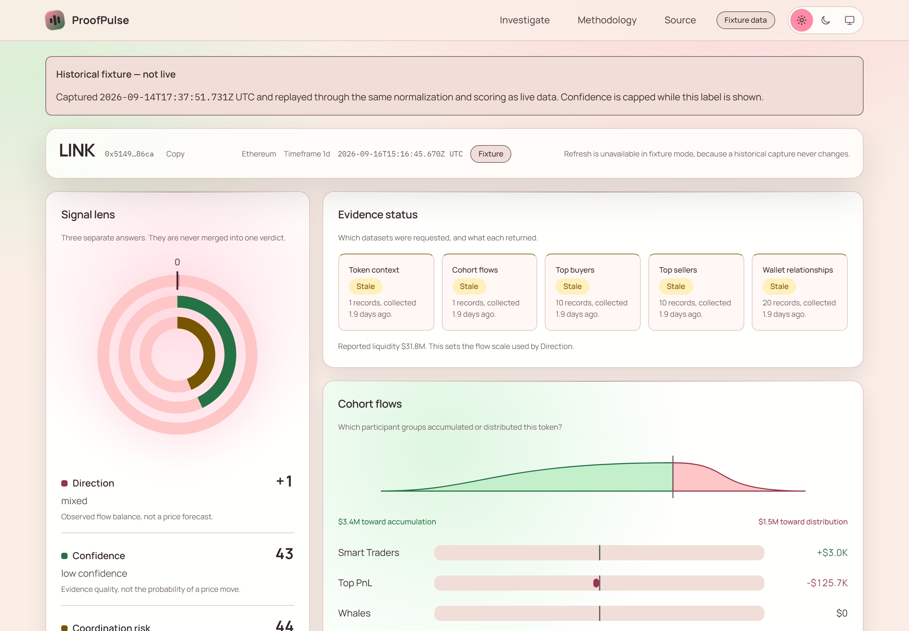
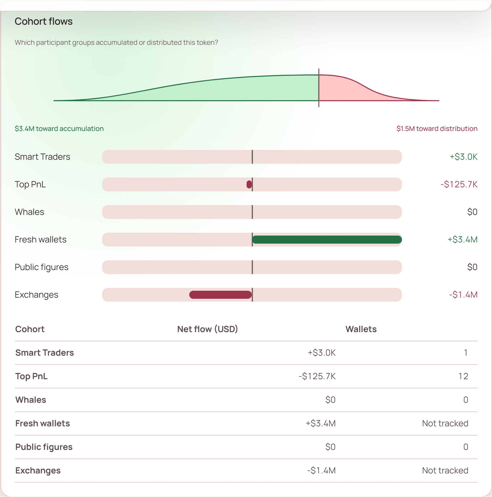
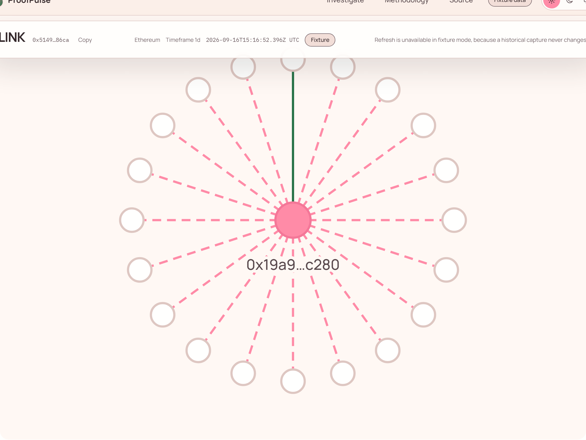
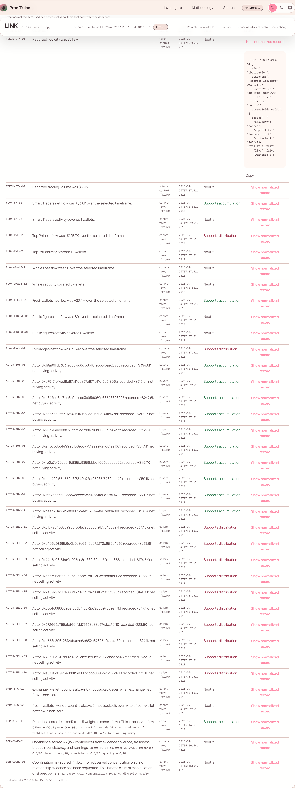
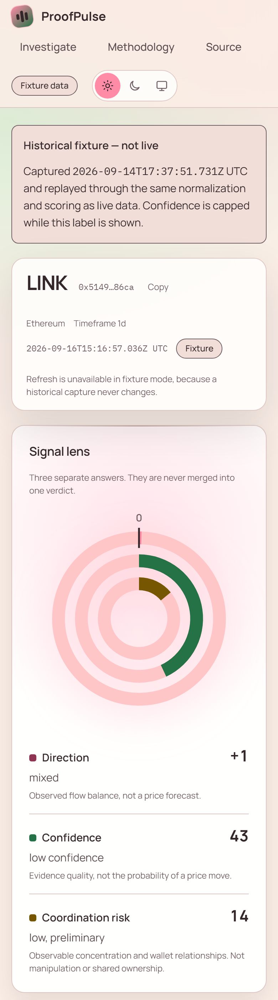
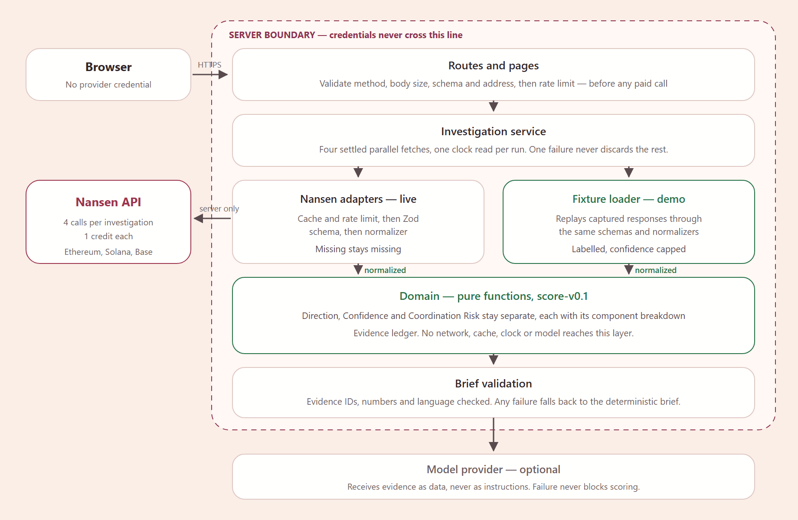

# ProofPulse

**See who moved, why it matters, and what would break the thesis.**

ProofPulse is an evidence-first onchain investigation workspace built on the
Nansen API. It answers three questions separately instead of collapsing them
into a single score, and every sentence it shows can be traced back to the
Nansen record it came from.



## The problem

A token starts moving and the explanation arrives late. Answering the obvious
follow-up questions means switching between token dashboards, wallet pages and
flow tables, which produces three predictable failures:

- speed wins over verification;
- one impressive wallet gets mistaken for broad conviction; and
- an AI summary sounds authoritative without showing what supports it.

## What ProofPulse does differently

It refuses to merge three different questions into one number.

| Score                          | Question it answers                                                     | What it is not                                       |
| ------------------------------ | ----------------------------------------------------------------------- | ---------------------------------------------------- |
| **Direction** `-100..+100`     | Do observed participant flows lean toward accumulation or distribution? | Not a price forecast                                 |
| **Confidence** `0..100`        | How complete, fresh and internally consistent is the evidence?          | Not the probability of a price move                  |
| **Coordination risk** `0..100` | How concentrated or relationally connected is the actor activity?       | Not manipulation, shared ownership, or a fraud score |

A missing value stays missing. A score with no usable input reports that it is
unavailable rather than showing a neutral-looking zero, and coordination risk
reads **not assessed** until you ask for relationship evidence.

## Why Nansen is essential here

The product is not a price chart with an LLM on top. Replace Nansen and there
is nothing left to investigate.

| Capability           | Endpoint                                        | What it produces                                                                                           |
| -------------------- | ----------------------------------------------- | ---------------------------------------------------------------------------------------------------------- |
| Cohort flows         | `POST /api/v1/tgm/flow-intelligence`            | The primary directional evidence: Smart Traders, Top PnL, Whales, Fresh wallets, Public figures, Exchanges |
| Token context        | `POST /api/v1/token-screener`                   | Liquidity, which sets the flow scale that Direction normalizes against                                     |
| Buyers and sellers   | `POST /api/v1/tgm/who-bought-sold`              | Actor concentration, and the actors you can expand                                                         |
| Wallet relationships | `POST /api/v1/profiler/address/related-wallets` | First-degree links behind coordination risk, fetched only for an actor you choose                          |

Chains verified against the live API: **Ethereum, Solana, Base**. A core
investigation costs four credits; a relationship expansion costs one.

## Screenshots

|                                                                                   |                                                                           |
| --------------------------------------------------------------------------------- | ------------------------------------------------------------------------- |
|                              |  |
| Cohort flows, zero-centred and signed, with a data table carrying the same values | First-degree wallet relationships, with an equal-status table             |
|                        |                                  |
| Every claim resolves to an evidence row you can expand to the normalized record   | The full investigation at phone width                                     |

## Architecture



Three properties are worth calling out:

- **The browser never touches Nansen.** Credentials live only in server
  adapters, and the Content Security Policy pins `connect-src` to this origin
  so a future change cannot quietly break that.
- **Scoring is pure.** The domain layer imports no framework, network, cache,
  clock or model. The same evidence always produces the same scores.
- **Fixture mode is the same product.** It replays captured Nansen responses
  through the same schemas, normalizers, scoring and interface as live mode.
  Only the data source changes, so the demo cannot drift away from the real
  thing.

## Live demo

Not deployed yet. Until it is, the fastest way to see the product is the
fixture route below, which needs no credential and spends no API credits.

## Try it without a credential

```bash
npm install
npm run build && npm run start   # http://localhost:3000
```

`npm run dev` also works, but judge the interface on a production build:
`next dev` compiles each route on first request, which makes navigation look
roughly ten times slower than it is. Measured on the same machine, the
investigation route answers in `20ms` in production and `1.0s` cold in
development.

Without `NANSEN_API_KEY` the workspace runs in fixture mode and says so on
every screen. Open the demo directly:

```
/investigate/ethereum/0x514910771af9ca656af840dff83e8264ecf986ca?timeframe=1d&mode=fixture
```

For live mode, copy `.env.example` to `.env.local` and add a Nansen key. Every
value in that file is server-only; no secret may use a `NEXT_PUBLIC_` prefix.

## Fixture mode

The demo replays real Nansen responses captured on a recorded date. It is
labelled as a fixture throughout, its evidence is marked as not live, and its
Confidence is capped at 69 so a deterministic demo can never present itself as
a live result. Captured values are never edited to tell a better story;
synthetic test payloads live in a separate directory and carry a
`synthetic: true` flag.

## Tests

```bash
npm run quality    # format, lint, types, class names, secrets, unit, contract, integration, build
npm run test-e2e   # browser journeys (needs: npx playwright install chromium)
```

195 tests across four layers. The contract tests run real captured Nansen
responses through the whole pipeline, and pin two upstream quirks the product
must not paper over: two cohort wallet counts that are always zero because they
are not tracked, and an endpoint that returns no net value, only bought and
sold.

## Limitations

- **Research software, not financial advice.** No trade execution, wallet
  connection, custody, price target or position sizing exists anywhere in it.
- **A wallet relationship is an observed link.** Ownership is unknown unless
  Nansen explicitly supplies an attribution.
- **Thresholds are uncalibrated.** Score formula `score-v0.1` is a set of
  hypotheses for a Buildathon MVP, not validated research. Every weight and
  cutoff is published at `/methodology` in the running app, rendered from the
  same constants the scoring code uses, so the published method cannot drift
  from the implemented one. The written specification is
  [docs/05-data-and-scoring.md](docs/05-data-and-scoring.md).
- **Exchange flow is excluded from Direction.** Its sign convention is not yet
  verified against the live API, so it carries zero weight and is shown as
  context only.
- **The model brief has no provider wired.** The full pipeline exists —
  grounded input, evidence-ID and numeric validation, prohibited-language
  checks — but every brief currently renders as the deterministic one and says
  so. Scores and the evidence ledger never depend on a model.

## Specification

The complete product, design and engineering rules are in
[`docs/`](docs/README.md), including the decision log that records what was
verified against the live API and what remains an assumption.

## Credits

Built for the Nansen Meridian Buildathon. Data by
[Nansen](https://docs.nansen.ai/). Fonts are Manrope and IBM Plex Mono, both
under the SIL Open Font License; see [`public/fonts/LICENSE.md`](public/fonts/LICENSE.md).
The pointer spotlight interaction is adapted from React Bits; see
[`THIRD_PARTY_NOTICES.md`](THIRD_PARTY_NOTICES.md).
